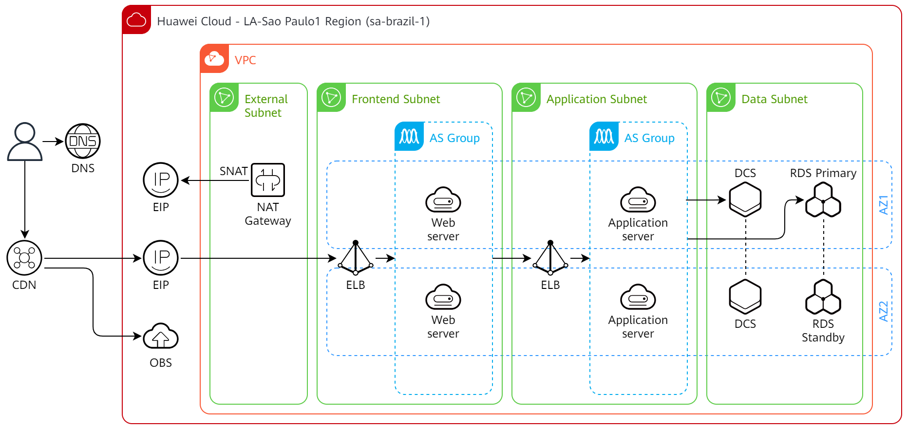
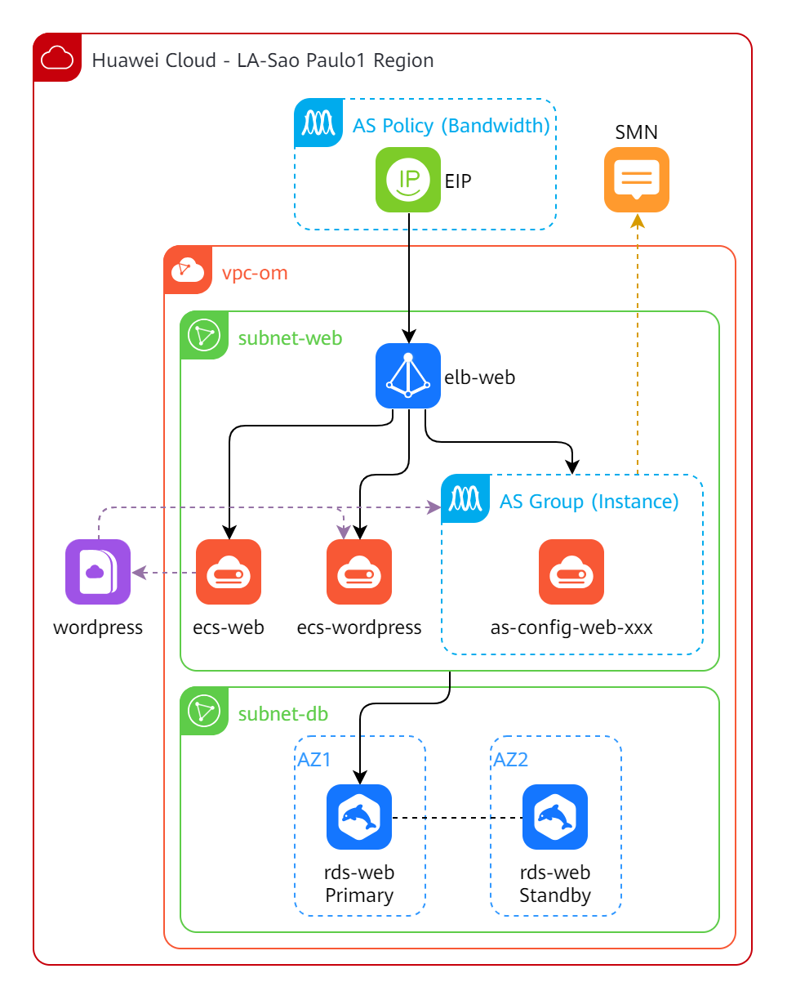

# Huawei Cloud services icons libraries for draw.io

[draw.io](https://www.drawio.com/) is a free and open source cross-platform
graph drawing software developed in HTML5 and JavaScript. Its interface can be
used to create diagrams such as flowcharts, wireframes, UML diagrams,
organizational charts and network diagrams.

Using the provided library you can draw [Huawei Cloud](https://www.huaweicloud.com/intl/en-us/)
system architectures.

There are two library groups: **color** and **line**. The ***color** group
contains the icons you see in the Console and in the product pages. The **line**
group contains the old icons (black and white) which are no longer being
maintained, but the service names will be updated in a best-effort basis.

## Installation (manual)

1. If you installed a previous version, remove old libraries by clicking on the
   "Close" (X) button of each library in draw.io. Then, delete the library
   files (XML) of old versions;
2. Place the libraries on a known folder (e.g. "D:\drawio_libs");
3. Open Draw.io, click on "File" > "Open Library..." menu and load each
   XML file inside **color** and **line** folders. Unfortunately, right now
   draw.io does not allow to select multiple files at once, so you need to
   repeat this step for each file.

## Architecture examples

