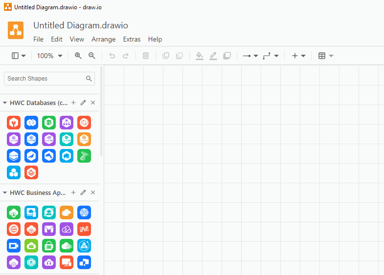
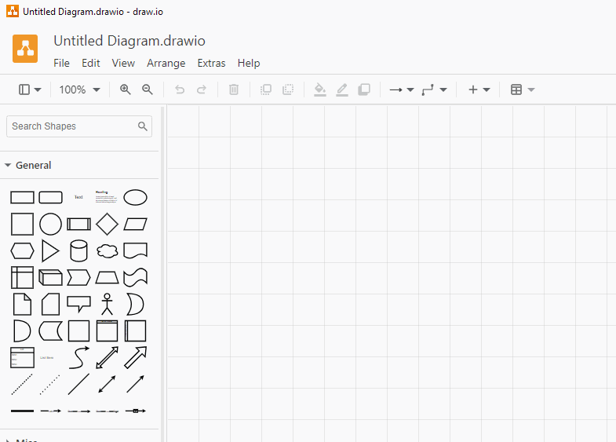
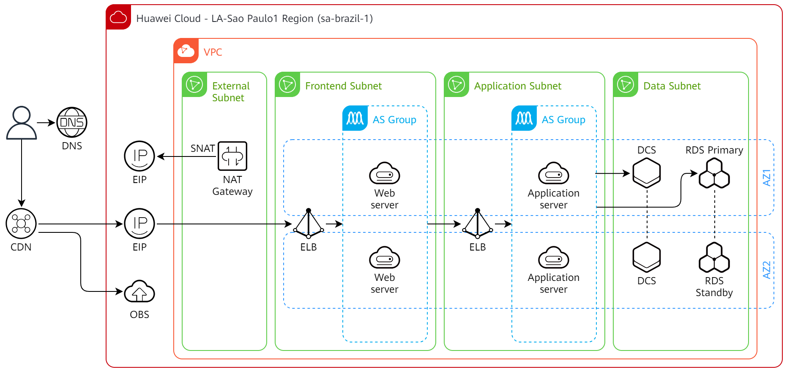
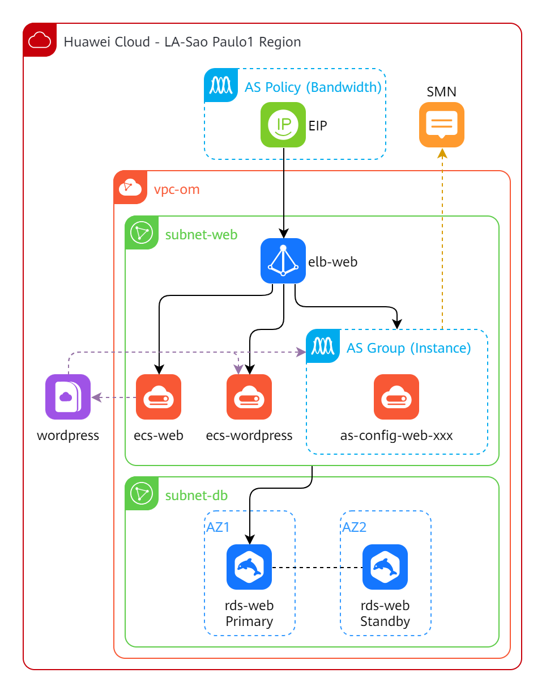

# Huawei Cloud services icons libraries for draw.io

🌐 **Language**: **English** | [Português](./README.pt.md)

[draw.io](https://www.drawio.com/) is a free and open source cross-platform
graph drawing software developed in HTML5 and JavaScript. Its interface can be
used to create diagrams such as flowcharts, wireframes, UML diagrams,
organizational charts and network diagrams.

Using the provided library you can draw [Huawei Cloud](https://www.huaweicloud.com/intl/en-us/)
system architectures.

There are two library groups: **color** and **line**. The **color** group
contains the icons you see in the Console and in the product pages. The **line**
group contains the old icons (black and white) which are no longer being
maintained, but the service names will be updated in a best-effort basis.

## 💿 Installation (manual)

1. Download the latest release available:
   - Click on the available version at **Releases** section on the right side
     of this page;
   - Click on **Source code (zip)** link under **Assets** to download the zip file;
2. Remove old libraries (if you installed them previously):
   - Open draw.io and click on "Close" (X) button beside each library name;
   - Locate the library files (arquivos XML) in your computer and delete them;

   

3. Decompress the zip file you downloaded at step 1 in a folder of your choice
   (e.g. "D:\drawio_libs");
4. Install libraries on draw.io:
   - Open draw.io, click on "File" > "Open Library..." menu;
   - Select a XML file from **color** or **line** folder;
   - draw.io does not allow to select more than one file at once, so you need
     to repeat the process for each XML file inside each **color** and **line**
     folder.

   

## 🌟 Architecture examples

