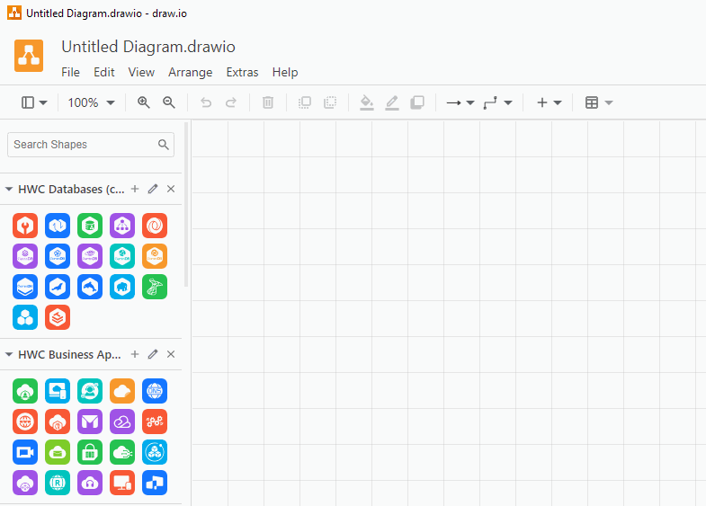

# Biblioteca de ícones dos serviços da Huawei Cloud para o draw.io

🌐 **Idioma**: [English](./README.md) | **Português**

O [draw.io](https://www.drawio.com/) é um software de desenho multiplataforma,
gratuito e de código aberto, desenvolvido em HTML5 e JavaScript Com ele, é
possível pode ser usado para criar diagramas tais como fluxogramas, protótipos,
diagramas UML, organogramas e diagramas de rede.

Com as bibliotecas disponibilizadas neste repositório, é possível desenhar
arquiteturas de sistemas na [Huawei Cloud](https://www.huaweicloud.com/intl/pt-br/).

Há dois grupos de bibliotecas: **color** e **line**. O grupo **color** contém
os ícones coloridos que podem ser vistos no Console e nas páginas dos produtos.
O grupo **line** contém os ícones antigos (em preto e branco) que não são mais
mantidos, mas os nomes dos serviços serão atualizados na medida do possível.

## 💿 Instalação (manual)

1. Baixe a última versão disponível:
   - Clique na versão disponível na seção **Releases** do lado direito desta página;
   - Clique em **Source code (zip)** abaixo de **Assets** para baixar o arquivo zip;
2. Remova as bibliotecas antigas (se você já instalou as bibliotecas anteriormente):
   - Abra o draw.io e clique no botão "Close" (X) ao lado do nome de cada
     biblioteca;
   - Localize os arquivos das bibliotecas (arquivos XML) no seu disco e apague-os;

   

3. Descompacte o arquivo zip que você baixou no passo 1 em uma pasta de sua
   escolha ("D:\drawio_libs" por exemplo);
4. Instale as bibliotecas no draw.io:
   - Abra o draw.io, clique no menu "File" > "Open Library..." ("Arquivo" >
     "Abrir biblioteca...");
   - Selecione um arquivo XML dentro da pasta **color** ou **line**
   - O draw.io não permite selecionar mais de um arquivo por vez, então você
     precisa repetir o processo para cada arquivo XML dentro de cada pasta
     **color** e **line**.

   

## 🌟 Exemplos de arquitetura

